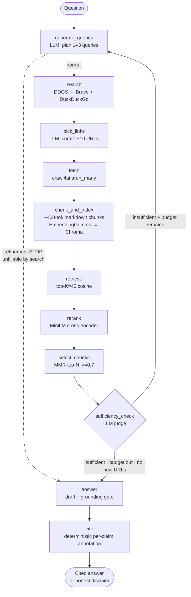

# Answer

[](https://w-sliman.github.io/answer/)
[](https://colab.research.google.com/github/w-sliman/answer/blob/main/demo/colab_live_demo.ipynb)

An agentic web-search and RAG system that answers research questions by planning queries, fetching live web pages, embedding and reranking them, and writing a **cited, grounded** answer — or **honestly disclaiming** when the evidence isn't there.

Built on **LangGraph**, **Gemma 4 E4B** (served via Ollama on a free Colab/Kaggle GPU), **EmbeddingGemma**, **Chroma**, and a **MiniLM cross-encoder**. The orchestration runs anywhere; only the model server needs a GPU.

The point of the project isn't a chatbot. It's an exercise in **agent-system architecture**: a question-shape-dependent refinement loop, a citation scheme where misattribution is *structurally impossible*, a draft-then-ground answer stage with deterministic per-claim citation, and a fail-loud schema philosophy. The eval and the frozen-run demo are built to show those properties directly.

---

## See it run

Three ways to experience it, from zero-setup to fully live:

- **Replay demo (static, always on).** A React site that replays one complete, real frozen run of 15 questions — you watch the pipeline plan, search, rank, judge, loop, and answer, then inspect every stage's real data and click any `[n]` citation to see the exact sentence-supporting quote. No backend, no model calls. **Live: https://w-sliman.github.io/answer/** — source in [`web/`](web/).
- **Live inference.** The same pipeline over HTTP: [`api.py`](api.py) is a FastAPI + SSE server that streams stages as they happen and returns the cited answer. Point it at a running Ollama and ask anything. Runs locally, or from Colab/Kaggle behind a tunnel — click the Colab badge above.
- **Local CLI.** A [CLI](run.py) that runs the full pipeline and writes the final state (queries, sources, chunks, citations) to `traces/`.

---

## What it does

Given a natural-language question, the system:

1. **Plans** 1–3 search queries — the model decides how many, based on question shape (factoid → 1, comparison → 2, multi-faceted → 3), under a hard schema cap.
2. **Searches** the live web (DDGS querying Brave + DuckDuckGo), merges results, dedups URLs.
3. **Picks** ~10 URLs worth fetching (LLM-curated from search snippets).
4. **Fetches** them concurrently with `crawl4ai`, extracts markdown.
5. **Chunks** into ~400-token markdown-aware pieces with deterministic content-addressable IDs.
6. **Embeds** with EmbeddingGemma (asymmetric query/document prefixes), persists in Chroma.
7. **Retrieves** top-40 by cosine, **reranks** with a cross-encoder, **selects** the final top-N with MMR (λ=0.7) for source diversity.
8. **Judges sufficiency** — an LLM decides whether the selected chunks actually support an answer. If the evidence is weak *and* budget remains *and* new URLs exist, it **loops back** to plan a different angle.
9. **Drafts** a freeform answer over the evidence, then a **grounding pass** binds each claim to its supporting chunk (bounded re-draft if a claim is unsupported).
10. **Cites** deterministically — a separate, model-free node annotates each sentence with `[n]` markers, *each carrying the specific quote that backs that sentence*, and assembles the per-URL bibliography in code.
11. **Disclaims** honestly when nothing supports the question — citing the adjacent facts it *did* find, not just refusing.

The model never writes a URL. It cites small integer chunk references; Python resolves them to sources deterministically. **Misattribution is structurally impossible.**

---

## Architecture

Every meaningful stage is its own LangGraph node, so the graph itself tells the architecture's story — and each node maps one-to-one onto a frozen fixture the demo replays.



The graph has **one outer loop** (sufficiency-gated refinement, capped at 2 iterations) and, inside the `answer` node, **one bounded re-draft loop** (grounding-gated, capped at 2 attempts). Both are bounded — no recursion runaway is possible. Three independent exit conditions guarantee termination: `sufficient`, `budget exhausted`, or `no new URLs` (diminishing returns).

---

## Design decisions worth defending

These are the choices I'd most want to be asked about.

### Citations by integer reference, never by URL

The answer stage works with small per-prompt integer chunk references (1..N), never raw URLs. Each chunk header in the prompt is numbered; Python builds that numbering and reverses it at render time to resolve reference → URL → `[n]` markers in prose.

This makes a class of bugs structurally impossible: the model cannot misattribute a quote to the wrong page, fabricate a URL, or half-remember a domain. The worst it can do is reference a chunk outside `1..N`, which Pydantic rejects and the pipeline fails loud on. The **storage** layer separately uses content-addressable hex IDs (hash over `url|position|content`) so Chroma dedups across runs — two design goals, two ID schemes.

### Draft first, then ground, then cite — as three separable concerns

The answer stage is deliberately split:

1. **Draft** — the model writes a freeform, citation-free answer over the evidence. Asking it to synthesize *and* place citations at once degrades both; separating them lets each be judged on its own.
2. **Ground** — an attribution pass maps each claim to the specific chunk text that supports it. If a claim is unsupported, the draft is regenerated with that feedback (bounded to 2 attempts, then it falls through to the disclaim path rather than commit an ungrounded answer).
3. **Cite** — a **separate, fully deterministic (model-free) LangGraph node** annotates the grounded draft: each sentence gets its `[n]` markers, and *each `[n]` carries the sentence-specific supporting quote*, not the source's aggregated quote bag. The per-URL bibliography is assembled in code.

Pulling `cite` out as its own node means citation is observable, replayable, and provably deterministic — the interactive `[n]` markers in the demo are a direct read-out of this.

### Two-stage retrieval, then MMR

Dense embedding (cosine) is fast but coarse — the right chunk often sits at position 25–35 of the K=40 candidates. The cross-encoder is slow but sharp; it rescores those 40 in ~1s on CPU. Then MMR (λ=0.7) selects the final top-N, balancing rerank relevance against embedding diversity.

The architectural reason for MMR: in early prototypes, most selected chunks could come from a single deeply-relevant URL. MMR's per-chunk diversity penalty disperses the picks across sources when the sources are topically near — without forcing fake diversity when one source genuinely is best.

### Question-shape-dependent query count

A factoid ("when was Anthropic founded?") needs one query. A multi-faceted question ("compare X, Y, Z across A, B, C") needs three. The model decides under a hard schema cap, and its planner reasoning is forced to *name the count before listing* — naming N binds the action. Tuned against a measured failure mode: small models default to "emit a couple of queries even when one would do." Worked examples in the prompt cover the 1-/2-/3-query cases explicitly. (On this small model, **examples beat rules** — a recurring, documented finding.)

### LLM sufficiency judge → refinement loop

After retrieval + rerank + MMR, an **LLM judge** reads the selected chunks and decides whether they actually support an answer (an earlier score-floor heuristic was replaced by this — the judge generalizes better than tuned thresholds). If it judges the evidence insufficient *and* the iteration budget isn't exhausted *and* `pick_links` surfaced new URLs, the graph loops back to `generate_queries`, feeding the planner the prior queries and the sufficiency reason so it takes a genuinely different angle.

### Disclaim with adjacent-fact citation

When the system can't find the answer, it doesn't just say "I don't know." It cites the *related* facts it did find: "I couldn't find Anthropic's specific Q3 2025 revenue. I did find that their annualized run rate reached \$30B by March 2026 [1]." The disclaim has a dedicated prompt with an expanded list of forbidden robot-speak ("the provided chunks", "the retrieved sources do not contain", …) and is written in first-person natural language.

### Fail-loud schema validation, with one bounded retry

Every LLM call uses Pydantic structured output with strict validators (length bounds, custom `@field_validator`s, duplicate-citation coalescing). Validation failures bubble up as exceptions, not silent fixes. The one concession is a bounded second attempt on the user-facing answer draft — losing a whole answer to a rare schema slip is worse than one extra call, but it still fails loud after attempt 2, never silently degrades.

### What was tried and dropped (a deliberate negative result)

A same-model **adversarial self-critique** gate (and later a dedicated relevance-check node) was built and A/B'd — and **rejected**. On this model it was stochastic and conflated honest under-answering with substitution, so it couldn't reliably gate. Keeping the grounding pass and cutting the critique was the better call — documenting a clean negative result is part of the point.

---

## The Gemma 4 E2B → E4B upgrade

The system originally ran on **Gemma 4 E2B** (~2B active params). A recurring limitation surfaced across the eval: a "2B ceiling" where the model would settle for the safest, most generic statement even when a sharper answer was retrievable — most visibly on a question whose sources gave both a headline figure and the real, model-specific maximum, where E2B answered only the headline.

Extensive prompt engineering could **not** fix it — across many answer-prompt variants, none beat the baseline; run-to-run variance exceeded prompt variance. It was a model-capacity limit, not a wording bug.

Swapping to **Gemma 4 E4B** (config-only, no code change) cracked it: the under-answer this project had documented as an accepted limitation is now answered **fully and correctly in the draft**, over the *same* retrieved chunks E2B under-answered on. E4B also reasons more sharply as a critic and synthesizes multiple sources better. The trade-off: E4B is a stricter critic that can over-fire.

The lesson worth keeping: **know when you're fighting the prompt vs. the model.** The measured A/B is what told us which.

---

## Eval

The stress dataset ([`eval/dataset_stress.yaml`](eval/dataset_stress.yaml)) covers 15 questions across 5 categories, each designed to probe a specific failure mode:

- **multi_faceted** — does the planner fan out and synthesize across sources?
- **refinement_rescue** — does the loop fire when the first pass misses, and rescue the answer?
- **polysemous** — does it disambiguate Mistral-the-company from mistral-the-wind?
- **multi_source_synthesis** — does it cite breadth, not just depth?
- **adversarial_with_context** — does it disclaim honestly when no public answer exists, while still citing related facts?

Eval has two check kinds: **correctness checks** (block "clean" — citations resolve to fetched pages, quotes appear verbatim, expected topics mentioned, disclaim language present) and **probe checks** (informational diagnostics — query count, whether the loop fired, source breadth). Run it with `uv run python eval/run_eval.py --dataset eval/dataset_stress.yaml`; per-question reports land in `eval/reports/`.

---

## How to run

### Prerequisites

- Python 3.12+ and [`uv`](https://github.com/astral-sh/uv)
- A running Ollama serving `gemma4:e4b` and `embeddinggemma:300m`, anywhere with a GPU. The Colab notebook at [`demo/colab_live_demo.ipynb`](demo/colab_live_demo.ipynb) does the whole thing on one free Colab runtime: Ollama + the models + `api.py` serving the built site, exposed via a Cloudflare quick tunnel.
- (Optional) a LangSmith account for LLM-call tracing.

### Setup

```bash
git clone https://github.com/w-sliman/answer && cd answer
uv sync                          # installs deps from uv.lock
cp .env.example .env             # then edit: Ollama URL + optional LangSmith key
uv run crawl4ai-setup            # one-time browser install for crawl4ai
```

### CLI

```bash
uv run python run.py "what is langgraph?"
```

Stage-by-stage output to the terminal; the full final state (queries, picked URLs, retrieved chunks, citations) lands as JSON in `traces/`.

### HTTP API + web frontend (live serving)

```bash
uv run uvicorn api:app --host 0.0.0.0 --port 8000
```

`POST /ask` streams the pipeline's structured events over SSE and returns the cited answer; `GET /health` is a health check. If the React site has been built (`cd web && npm install && npm run build`), the server also serves it at `/`. This is the path used to serve the live demo from Colab/Kaggle behind a tunnel.

### Eval

```bash
uv run python eval/run_eval.py --dataset eval/dataset_stress.yaml
```

Per-question traces go to `traces/`; a Markdown report goes to `eval/reports/`.

---

## Project layout

```
src/answer/
  pipeline.py         # LangGraph topology: 11 nodes, edges, state, the two loops
  prompts.py          # All Pydantic schemas + prompt builders + worked examples
  cite.py             # Deterministic, model-free per-claim annotation
  sufficiency.py      # LLM sufficiency judge
  config.py           # Every tuning knob in one file
  chunking.py         # Markdown-aware splitter + deterministic chunk IDs
  embedding.py        # EmbeddingGemma — Ollama /api/embed or OpenAI /v1/embeddings
  vector_store.py     # Chroma facade + RetrievalHit dataclass
  rerank.py           # Lazy-loaded MiniLM cross-encoder
  mmr.py              # Numpy MMR with min-max normalized relevance
  search.py           # DDGS wrapper (Brave + DuckDuckGo engines)
  fetch.py            # crawl4ai arun_many wrapper
  llm.py              # LLM factory — Ollama or OpenAI-compatible (llama.cpp) via LLM_BACKEND

api.py                # FastAPI + SSE live server (serves web/dist when built)
run.py                # CLI entry point

web/                  # React + Vite static site: replays one frozen run
demo/colab_live_demo.ipynb # One-click Colab: Ollama + api.py + built site + tunnel

eval/
  dataset_stress.yaml # 15 stress questions across 5 categories
  run_eval.py         # Eval runner; correctness vs probe checks
  build_site_data.py  # Flattens frozen fixtures → web/src/run.json
  freeze_*.py         # One freeze per node — offline replay stays faithful
```

---

## Known limitations

- **Search is scraper-backed, so it rate-limits.** The pipeline searches through DDGS,
  which *scrapes* the search engines rather than calling an API — so after roughly 7
  queries in a short window it gets throttled and refuses for a while. That's fine for
  this project (the demo captures one search pass and replays it, and the code paces
  requests and falls back across engines), but a real deployment should swap in a proper
  search API with a key and quota — e.g. the [Brave Search API](https://brave.com/search/api/).
- **Small local model.** Gemma 4 E4B is a small model on a free-tier GPU; it can still
  under-answer a hard multi-hop question or skip a dense benchmark table. The E2B → E4B
  upgrade (above) fixed the sharpest case, but the ceiling is real.

---

## Stack

- **Orchestration** — LangGraph (StateGraph, conditional edges)
- **LLM** — Gemma 4 E4B via Ollama on a free Colab/Kaggle GPU
- **Embedding** — EmbeddingGemma 300M, 768-dim (asymmetric task prefixes)
- **Reranker** — sentence-transformers `cross-encoder/ms-marco-MiniLM-L-12-v2`, CPU
- **Vector store** — Chroma (file-backed, per-job collections, content-addressable dedup)
- **Search** — DDGS (Brave primary + DuckDuckGo fallback)
- **Fetch** — crawl4ai (`AsyncWebCrawler.arun_many` for batched concurrency)
- **Structured output** — Pydantic v2 + LangChain `with_structured_output` (fail-loud)
- **Serving** — FastAPI + SSE; React + Vite + TypeScript frontend
- **Tracing** — LangSmith (optional) + project-local trace JSONs

---

## Status

Built and serviceable. The pipeline runs live over the API and replays offline in the demo site.
